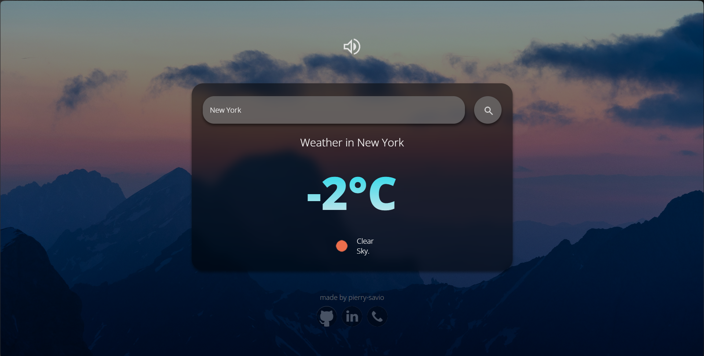

# ⛅ Weather App
[Weather App](https://pierry-savio.github.io/weather-app/) is a website where you can obtain information about the weather in a specific region through a real-time API.

 👉 [Click here](https://pierry-savio.github.io/weather-app/) to acess the website 👈

## ✅ Features

- Search and get any city weather
- Music on/off button
- Weather icon that changes according to the weather.
- Multiplatform

## 💻 Technologies

**Front-end:** HTML, CSS, JavaScript

## ⛈ How to Use

1. Start [clicking here](https://pierry-savio.github.io/weather-app/) to acess the website.
2. Type the target city in the "Type the city's name" input.
3. Press the search button.

You can also enable/disable the music pressing the sound button 🔈.

## License

This project is licensed under the MIT License. See [LICENSE](https://choosealicense.com/licenses/mit/) for details.

## ✒ Authors

Made by **Pierry Savio**
- [LinkedIn - @pierry-dev](https://www.linkedin.com/in/pierry-dev/)
- [GitHub - @pierry-savio](https://github.com/pierry-savio)

